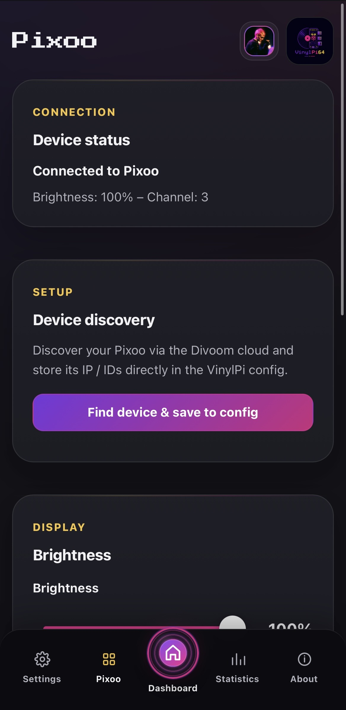
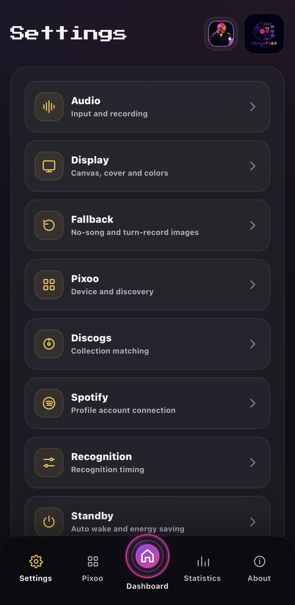
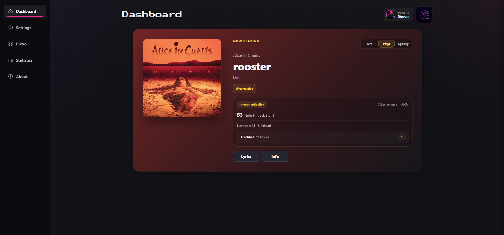
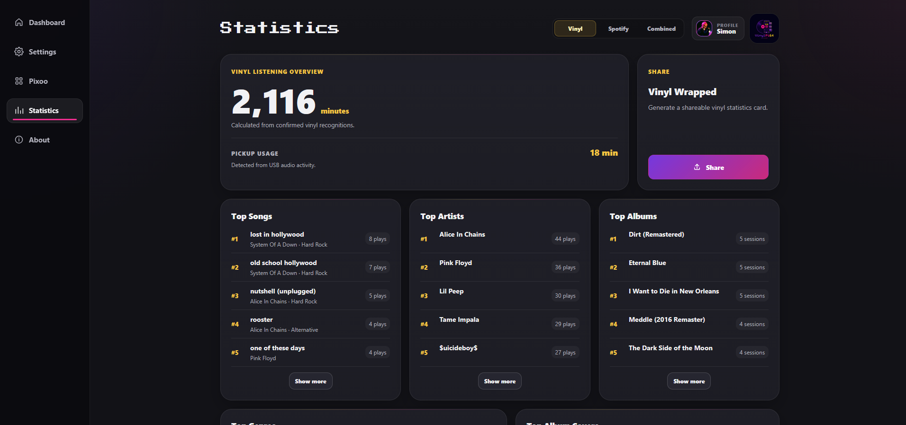

# VinylPi64

<p align="center">
  
  
  
  <a href="https://github.com/simontrost/VinylPi64/stargazers"></a>
</p>

VinylPi64 identifies music from a USB turntable with **ShazamIO** or from **Spotify**, builds a custom **64×64 pixel frame**, and displays it on a **Divoom Pixoo-64**. A local web app provides controls, settings, lyrics, device management, and listening statistics.

<p align="left">
  
</p>

## Features

- Vinyl recognition from USB audio with ShazamIO and Spotify playback recognition
- Album artwork, artist, title, album, genre, and track metadata
- Low-power audio standby with configurable wake-on-audio and audio-level auto-standby
- Optional failure-based auto-standby for Vinyl and Spotify
- Pickup usage tracking based on configurable input-level thresholds
- Custom Pixoo renderer with:
  - dynamic or manual background and text colors
  - configurable cover size, typography, spacing, and marquee text
  - fallback images
- Local web app with:
  - live dashboard updates and Vinyl / Spotify / Off modes
  - lyrics and track information
  - Pixoo brightness, channels, discovery, reboot, and community GIFs
  - statistics for listening time, pickup usage, songs, artists, albums, genres, and covers
- SQLite storage for songs, statistics, caches, and runtime state
- Configurable adaptive sample duration after failed recognitions
- Optional Home Assistant color-sync integration

## Hardware

This project was built and tested with:

- Raspberry Pi Zero 2 W
- Audio-Technica AT-LP120XUSB
- Divoom Pixoo-64

Other hardware can work as well, but may require adjustments. A turntable without USB output needs a compatible USB audio interface, and another display type requires a different display integration.

## Screenshots

### Generated Pixoo frame

<p align="left">
  
</p>

### Hardware setup

<p align="left">
  
</p>

### Web app
| Pixoo | Settings |
|---|---|
|  |  |

| Dashboard | Statistics |
|---|---|
|  |  |

## Quick setup

### 1. Install system packages

On Raspberry Pi OS or another Debian-based system:

```bash
sudo apt update
sudo apt install -y git python3-venv python3-dev ffmpeg libportaudio2
```

### 2. Clone and install

```bash
git clone https://github.com/simontrost/VinylPi64.git
cd VinylPi64
python3 -m venv venv
source venv/bin/activate
python -m pip install --upgrade pip
pip install -r requirements.txt
```

### 3. Check the audio source

```bash
arecord -l
```

Make sure your USB turntable or audio interface appears in the list. The device name can later be selected in the web settings.

### 4. Start the web app

```bash
source venv/bin/activate
python -m vinylpi.web.dashboard
```

Open:

```text
http://<device-ip>:8080/
```

On many local networks, this may also work:

```text
http://vinylpi.local:8080/
```

The recognizer can be started and stopped from the dashboard. It can also be launched directly with:

```bash
python -m vinylpi.main
```

## Configuration

Most options can be changed from the **Settings** page. This includes:

- audio device, sample rate, channels, and recording duration
- adaptive recording durations after failed recognitions
- wake-on-audio, pickup thresholds, and Vinyl/Spotify standby behavior
- Spotify polling interval
- Pixoo layout, colors, text, cover size, and scrolling
- fallback images and Pixoo discovery
- Home Assistant integration and debug settings

The configuration is stored in:

```text
data/config.json
```

Runtime data is stored in:

```text
data/vinylpi.db
```

This database contains song history, play counts, listening statistics, caches, and the current dashboard state.

## Optional: start on boot

Create a systemd service:

```bash
sudo nano /etc/systemd/system/vinylpi.service
```

Example:

```ini
[Unit]
Description=VinylPi64
After=network-online.target
Wants=network-online.target

[Service]
User=pi
WorkingDirectory=/home/pi/VinylPi64
ExecStart=/home/pi/VinylPi64/venv/bin/python -m vinylpi.web.dashboard
Restart=on-failure
RestartSec=3

[Install]
WantedBy=multi-user.target
```

Adjust the username and paths, then enable the service:

```bash
sudo systemctl daemon-reload
sudo systemctl enable --now vinylpi.service
```

Useful commands:

```bash
sudo systemctl status vinylpi.service
journalctl -u vinylpi.service -f
```

## Optional: API token

Local API endpoints can be protected with an environment variable:

```bash
VINYLPI_API_TOKEN=replace_with_a_long_random_value
```

Store it in `vinylpi.env` and keep that file private.

## Optional: Home Assistant

VinylPi64 can send the dominant album-cover color to a Home Assistant webhook whenever a new song is recognized.

Enable the integration in the Settings page and provide:

- Home Assistant base URL
- webhook ID

Example Home Assistant automation:

```yaml
alias: VinylPi Color Sync
triggers:
  - trigger: webhook
    webhook_id: vinylpi_cover_color
    allowed_methods:
      - POST
      - PUT
    local_only: true
conditions:
  - condition: state
    entity_id: input_boolean.vinylpi_color_sync
    state: "on"
actions:
  - action: light.turn_on
    target:
      entity_id:
        - light.lamp1
        - light.lamp2
    data:
      rgb_color:
        - "{{ trigger.json.r | int }}"
        - "{{ trigger.json.g | int }}"
        - "{{ trigger.json.b | int }}"
mode: restart
```

Additional local API endpoints can be used for Pixoo power, music mode, and remote GIF playback.

## Recognition notes

Vinyl recognition uses recorded audio samples. Adaptive sampling can automatically use longer recordings after failed attempts and return to the base duration after a successful recognition.

With **Wake on Audio** enabled, the Off state keeps only a lightweight RMS level monitor active. Vinyl recognition starts when the configured wake threshold is reached and can return to standby after sustained low input. Pickup usage is measured from the same audio data, so it does not require a second audio stream.

Recognition quality depends on the audio level, selected passage, background noise, and Shazam's result. Quiet intros, live versions, heavy surface noise, or very short samples can reduce accuracy.

## Troubleshooting

### Audio device not found

```bash
arecord -l
```

Verify that the configured device-name filter matches the listed USB device.

### Web app starts, but recognition does not

Check the service logs or run the recognizer manually:

```bash
python -m vinylpi.main
```

### Pixoo does not respond

- confirm that the Pixoo and VinylPi are on the same network
- use device discovery in the Pixoo page
- verify the saved IP address
- reboot the Pixoo from the web app

### Service fails after an update

```bash
source venv/bin/activate
pip install -r requirements.txt
sudo systemctl restart vinylpi.service
```

## License

VinylPi64 is licensed under the Creative Commons Attribution–NonCommercial 4.0 International license.

See [LICENSE](LICENSE) for the full license text.
